# CoinFlow 技术架构文档

> **文档版本**：v1.0（2026-05-12）
> **目标读者**：iOS 开发者、技术评审、新成员 Onboarding、外部技术读者
> **项目阶段**：Phase 1（M1–M9）+ M10（LLM 账单总结）+ M11（视觉打磨）已交付
> **关联文档**：[`README.md`](./README.md)、[`CoinFlow-iOS-MVP技术设计.md`](./CoinFlow-iOS-MVP技术设计.md)、[`CoinFlow/PROJECT_STATE.md`](./CoinFlow/PROJECT_STATE.md)

---

## 目录

- [一、整体架构与技术选型](#一整体架构与技术选型)
  - [1.1 系统架构设计](#11-系统架构设计)
  - [1.2 核心技术栈](#12-核心技术栈)
  - [1.3 模块划分与职责边界](#13-模块划分与职责边界)
- [二、配置与交互流程详解](#二配置与交互流程详解)
  - [2.1 项目环境配置](#21-项目环境配置)
  - [2.2 关键功能模块的交互流程](#22-关键功能模块的交互流程)
  - [2.3 网络请求与数据流处理](#23-网络请求与数据流处理)
  - [2.4 UI 与业务逻辑的交互关系](#24-ui-与业务逻辑的交互关系)
- [三、可视化设计文档](#三可视化设计文档)
  - [3.1 核心模块 UML 类图](#31-核心模块-uml-类图)
  - [3.2 主要业务时序图](#32-主要业务时序图)
  - [3.3 状态转换图](#33-状态转换图)
- [四、数据结构设计](#四数据结构设计)
  - [4.1 本地数据存储方案](#41-本地数据存储方案)
  - [4.2 网络接口数据模型](#42-网络接口数据模型)
  - [4.3 缓存数据结构与持久化策略](#43-缓存数据结构与持久化策略)
  - [4.4 数据迁移与版本管理](#44-数据迁移与版本管理)
- [附录 · 文档↔代码索引](#附录--文档代码索引)

---

## 一、整体架构与技术选型

### 1.1 系统架构设计

#### 1.1.1 架构模式选择：分层 + MVVM + Repository

CoinFlow 采用 **「分层架构 + SwiftUI MVVM + Repository 模式」** 的复合模式，其中：

| 模式 | 适用层 | 选择依据 |
|---|---|---|
| **分层（Layered）** | 整体 | 严格区分 UI / 应用状态 / 领域能力 / 数据，层间单向依赖；上层换主题/换 UI 框架不影响数据层 |
| **MVVM（SwiftUI 原生）** | UI 层（Features） | SwiftUI 的 `@Published` + `ObservableObject` 天然契合 MVVM；表单双向绑定零样板 |
| **Repository** | 数据层（Data） | 屏蔽 SQLCipher 底层细节，对上提供 `insert / update / list / softDelete` 等领域方法；便于单元测试 mock |
| **Actor 隔离** | 同步队列 / 飞书客户端 | Swift Concurrency 的 actor 保证 `SyncQueue` / `FeishuBitableClient` / `FeishuTokenManager` 串行化，防止并发同时建表/刷 token |
| **Coordinator（轻量）** | 跨 Tab 跳转 | `MainCoordinator` + `pendingAction` 解决"流水页右上 +" → "切到首页打开新建 Modal"等跨域跳转，避免 NotificationCenter 生命周期坑 |

**为什么不选 VIPER / Clean Architecture？**
- 单端、单人/小团队 iOS App，引入完整 VIPER 会增加 4–5 倍的样板代码
- SwiftUI 的声明式特性使 ViewModel 直接持有 `@Published` 状态即可解决 90% 跨视图共享，无需 Presenter 层
- MVVM 已能满足"View ↔ ViewModel ↔ Repository"的清晰 3 层

#### 1.1.2 架构总览图

```
┌─────────────────────────────────────────────────────────────────┐
│  UI 层（SwiftUI + Notion 主题）                                   │
│  Features/{Main, Records, NewRecord, RecordDetail, Capture,      │
│            Voice, Stats, Sync, Settings, Categories,             │
│            Onboarding, Common}                                   │
│  Theme/{NotionTheme, NotionColor, NotionFont, LiquidGlass*}      │
└────────────────────────┬────────────────────────────────────────┘
                         │ @EnvironmentObject AppState
                         │ @StateObject ViewModel
┌────────────────────────▼────────────────────────────────────────┐
│  应用状态层                                                       │
│  App/{CoinFlowApp, AppState, BiometricLockView, PrivacyShieldView}│
│  Features/Common/MainCoordinator                                 │
└────────────────────────┬────────────────────────────────────────┘
                         │
┌────────────────────────▼────────────────────────────────────────┐
│  领域与能力层                                                     │
│  Capture: OCRRouter / Vision OCR / LLM Vision / ReceiptParser    │
│           / QuotaService / ScreenshotInbox / AppIntent           │
│  Voice  : AudioRecorder / ASRRouter / SFSpeech                   │
│           / BillsLLMParser / VoiceWizardViewModel                │
│  Stats  : StatsViewModel / BillsSummaryService(actor)            │
│           / BillsSummaryAggregator / Scheduler / LLMClient       │
│  Security: BiometricAuthService(LAContext)                       │
└────────────────────────┬────────────────────────────────────────┘
                         │
┌────────────────────────▼────────────────────────────────────────┐
│  数据层                                                           │
│  Database     : SQLCipher 4 + Schema + Migrations + SQLBinder    │
│  Repositories : Record / Category / Ledger / VoiceSession        │
│                 / UserSettings / BillsSummary                    │
│  Models       : Record / Category / Ledger / VoiceSession        │
│                 / BillsSummary                                   │
│  Sync         : SyncQueue(actor) / SyncTrigger / SyncLogger      │
│                 / RecordBitableMapper / SummaryBitableMapper     │
│                 / RemoteRecordPuller                             │
│  Feishu       : FeishuConfig / TokenManager(actor)               │
│                 / BitableClient(actor)                           │
│  Storage      : ScreenshotStore / RemoteAttachmentLoader         │
│  Seed         : DefaultSeeder（默认账本+14 预设分类）              │
└─────────────────────────────────────────────────────────────────┘
```

#### 1.1.3 核心设计原则

| 原则 | 落地实现 |
|---|---|
| **金额精度第一** | `Record.amount: Decimal`；SQLite `TEXT` 列存 `String(describing:)`；全栈禁用 `Double` 中转 |
| **时间统一 UTC** | `occurred_at: INTEGER` 存 UTC 秒；`timezone: TEXT` 保留 IANA（`Asia/Shanghai`）便于跨时区还原 |
| **软删除** | 所有业务表带 `deleted_at`；`voice_session` 例外（用 `status='cancelled'`） |
| **SQL 100% 参数化** | `SQLBinder` 统一 `Decimal/Date/[String]` ↔ TEXT 互转；动态列名走 `precondition` 白名单 |
| **路由可降级** | OCR / ASR / LLM 三档路由，失败自动降级；不阻塞主流程 |
| **同步不阻塞 UI** | `SyncQueue` 后台 actor + 指数退避；transient 自动重试，permanent 立即 dead |
| **同步元操作不污染 `updated_at`** | `markSyncing/markSynced/markFailed` 三方法绝不改 `updated_at`（M8 关键修复，保证 FIFO 真实序） |
| **密钥不进代码** | `Config.plist` `.gitignore`；`AppConfig` 单例懒读；运行时缺失返空串不崩溃 |

---

### 1.2 核心技术栈

#### 1.2.1 平台与语言

| 项 | 版本 / 选择                    | 备注 |
|---|----------------------------|---|
| **平台** | iOS 17.0+                  | SwiftUI 新 API（`PhotosPicker` / `safeAreaInset` / `presentationDetents`） |
| **语言** | Swift 5.9+                 | Strict Concurrency / `actor` / `@MainActor` |
| **IDE** | Xcode 26+                  | |
| **UI 框架** | SwiftUI（100%）              | 无 UIKit View 主路径；仅在 `AmountTextFieldUIKit` / `NoteTextFieldUIKit` / `CameraPicker` 等键盘体验细节处包 UIKit |
| **架构** | MVVM + Repository          | `ObservableObject` + `@Published` |
| **包管理** | Swift Package Manager      | |
| **构建脚本** | `scripts/gen_xcodeproj.py` | 全脚本化生成 `pbxproj` 避免多人合并冲突 |

#### 1.2.2 依赖库（SPM）

| 库 | 用途 | 引入位置 |
|---|---|---|
| **SQLCipher.swift 4.10.0** | 本地 256-bit AES 加密 SQLite | `Data/Database/DatabaseManager.swift` |
| **swift-markdown-ui** | M10 账单总结浮窗 markdown 渲染 | `Features/Stats/Summary/Views/SummaryFloatingCard.swift` |

> 项目刻意保持极轻依赖：未引入 RxSwift / Alamofire / Realm / Firebase 等重型库；
> HTTP 走 `URLSession`，状态管理走 SwiftUI 原生 `Combine`。

#### 1.2.3 平台 SDK 能力

| SDK | 用途 |
|---|---|
| **Foundation** | `URLSession` 网络、`Decimal` 金额、`JSONSerialization` |
| **SwiftUI / Combine** | UI 与响应式状态 |
| **SQLCipher / SQLite3** | 本地加密存储 |
| **Security / Keychain** | 数据库密钥（`AfterFirstUnlockThisDeviceOnly`） |
| **LocalAuthentication（LAContext）** | Face ID / Touch ID 启动锁 |
| **Vision** | 本地 OCR 文字识别（档 1） |
| **Speech (SFSpeechRecognizer)** | 强制 `requiresOnDeviceRecognition=true` 的本地 ASR |
| **AVFoundation** | `AVAudioRecorder` AAC-LC 录音 |
| **PhotosUI** | `PhotosPicker` 截图选择 |
| **AppIntents** | `CoinFlowCaptureIntent`（Back Tap → Shortcuts → 唤醒 App） |
| **Charts（iOS 16+）** | 统计页图表（V2 实装） |

#### 1.2.4 LLM Provider 矩阵（OpenAI 兼容）

所有 Provider 统一走 OpenAI 兼容协议（`LLMTextClient.OpenAICompatibleLLMClient`），用户在设置中切换：

| Provider         | 文本（语音多笔） | 视觉（OCR） | 总结（M10） | 默认模型 |
|------------------|---|---|---|---|
| `modelscope`（魔搭） | ✅ | ✅ | ✅ | `moonshotai/Kimi-K2.5` / `Qwen/Qwen3-VL-235B-A22B-Instruct` |
| `deepseek`       | ✅ | – | ✅ | `deepseek-v4-flash` |
| `stub`           | – | – | – | 不发起请求；走规则引擎兜底 |

---

### 1.3 模块划分与职责边界

按物理目录与职责边界划分，全部位于 [`CoinFlow/CoinFlow/`](./CoinFlow/CoinFlow/)：

#### 1.3.1 `App/` —— 应用入口与全局状态

| 文件 | 职责 |
|---|---|
| `CoinFlowApp.swift` | `@main` 入口；ScenePhase 监听；privacy shield / biometric lock 叠加；`.preferredColorScheme(.dark)` |
| `AppState.swift` | 全局 `ObservableObject`；串行 bootstrap；暴露 `database/seed/feishu` 三态 + `pendingSummaryPush`；用户主动操作入口（`manualSyncTickWithRevive` / `pullFromFeishu` / `wipeRemoteAndResync`） |
| `BiometricLockView.swift` | 启动锁屏页（仅冷启动） |
| `PrivacyShieldView.swift` | 应用切换器隐私模糊层（`scenePhase != .active`） |

**边界**：`App/` 不引用具体业务（如 `Record`），仅协调 `Data/` + `Features/` 启动顺序。

#### 1.3.2 `Config/` —— 配置中心

| 文件 | 职责 |
|---|---|
| `AppConfig.swift` | 对外 API 单例；当前激活的 LLM Provider 凭据映射器 |
| `SystemConfigStore.swift` | 持久化（Keychain 敏感字段 + UserDefaults 普通字段）；`didChangeNotification` |
| `Config.plist` / `Config.example.plist` | 运行期 fallback；线上 Config.plist 已 `.gitignore` |

**边界**：`AppConfig` 不直接读写 `UserDefaults`；统一走 `SystemConfigStore`。

#### 1.3.3 `Data/` —— 数据层（Repository 模式）

```
Data/
├── Database/      DatabaseManager(单例) / Schema / Migrations / SQLBinder
├── Models/        Record / Category / Ledger / VoiceSession / BillsSummary
├── Repositories/  SQLite{Record,Category,Ledger,VoiceSession,UserSettings,BillsSummary}Repository
│                  + RecordChangeNotifier（变更广播）
├── Sync/          SyncQueue(actor) / SyncTrigger / SyncLogger
│                  + RecordBitableMapper / SummaryBitableMapper / RemoteRecordPuller
├── Feishu/        FeishuConfig / TokenManager(actor) / BitableClient(actor)
├── Seed/          DefaultSeeder
└── Storage/       ScreenshotStore（OCR 截图磁盘缓存）/ RemoteAttachmentLoader
```

**边界**：Data 层不依赖 UI / Features；Features 通过 Repository 协议访问数据。

#### 1.3.4 `Features/` —— 业务模块（按功能分目录）

| 子目录 | 主要职责 |
|---|---|
| `Main/` | `MainTabView`（4 Tab）、`HomeMainView`、`StatsHubView` |
| `Records/` | 流水列表（List/Stack/Grid 三视图）+ ViewModel |
| `NewRecord/` | 新建账单 Modal + ViewModel + 分类选择 Sheet |
| `RecordDetail/` | 详情 / 编辑 Sheet |
| `Capture/` | OCR 截图记账完整链路（PhotoPicker / OCRRouter / Vision / LLM 视觉 / 规则解析 / 配额 / Intent） |
| `Voice/` | 语音多笔记账（AudioRecorder / ASRRouter / BillsLLMParser / 7-phase Wizard VM） |
| `Categories/` | 分类管理（Icon 库 / 调色板 / 编辑） |
| `Stats/` | 统计入口卡 + 子图表 + **`Summary/` M10 LLM 账单总结子模块** |
| `Sync/` | `SyncStatusView`（同步状态页） |
| `Settings/` | 设置 / 外观 / Back Tap 引导 / 数据导入导出 / 系统配置 |
| `Onboarding/` | 首启引导 |
| `Common/` | 跨模块共享：金额格式化、日期分组、键盘 Toolbar、Coordinator |

**边界**：`Features/` 之间通过 `MainCoordinator` 协调跨域跳转；同 Tab 内不互相直接 import。

#### 1.3.5 `Theme/` —— 主题系统

| 文件 | 职责 |
|---|---|
| `NotionTheme.swift` | 字号 / spacing / radius / motion token（默认主题） |
| `NotionColor.swift` + `NotionTheme+Aliases.swift` | 语义色板 + alias |
| `NotionFont.swift` | PingFangSC 封装 + 系统回退 |
| `LiquidGlassATheme.swift` / `LiquidGlassRealTheme.swift` | iOS 26+ Liquid Glass 实验主题（默认未启用） |
| `PressableButtonStyle.swift` / `Motion.swift` | 通用动效 token |
| `AmountTintStore.swift` | 金额染色策略（自动 / 收入绿 / 支出红 / mono） |

**边界**：所有 Color 走 `NotionColor` / 语义别名；不允许裸写 `Color(hex:)` / 固定 `pt`。

#### 1.3.6 `Security/` 与 `Resources/`

- `Security/BiometricAuthService.swift`：LAContext 封装，重入保护
- `Resources/Prompts/BillsSummary.system.md`：M10 LLM system prompt 资源
- `Resources/Assets.xcassets/AppIcon.appiconset/`：M11 App 图标

---

## 二、配置与交互流程详解

### 2.1 项目环境配置

#### 2.1.1 配置分层

CoinFlow 不区分 dev/staging/prod 多环境（个人 App + 用户自带飞书账号），但通过 **三层配置体系** 区分敏感度与生命周期：

| 层 | 存储介质 | 内容 | 生命周期 |
|---|---|---|---|
| **代码常量** | Swift 源码 | 默认值（baseURL fallback、模型默认 ID、超时秒数） | 编译期固定 |
| **`Config.plist`（旧）** | App Bundle | 历史兼容；当前已 fallback 到 SystemConfigStore | 安装时 |
| **`SystemConfigStore`** | Keychain（敏感）+ UserDefaults（非敏感） | 用户运行期填写：飞书 App ID/Secret、LLM API Key、外观偏好等 | 用户级；卸载随设备策略清理 |
| **`UserDefaults` 镜像** | UserDefaults | bootstrap 前需要的早期状态：`onboarding.completed_mirror` / `security.biometric_enabled_mirror` / `sync.auto_enabled_mirror` | 启动早期；DB 就绪后 reconcile 一次 |

#### 2.1.2 关键配置项（运行时由用户填写）

| Key | 用途 | 不配置后果 |
|---|---|---|
| `Feishu_App_ID` / `Feishu_App_Secret` | 飞书自建应用鉴权 | 纯本地模式；同步状态显示"未配置" |
| `Feishu_Wiki_Node_Token` / `Feishu_Bills_Table_Id` | Wiki 模式（推荐） | fallback 自动建表 |
| `Feishu_Folder_Token` | 自动建表模式的目标文件夹 | 默认建到"我的空间"根 |
| `Feishu_Owner_Open_ID` | 给 owner 自动加 `full_access` 协作权限 | owner 在飞书侧只读 |
| `LLM_Text_Provider` + 对应 `*_API_Key` | 语音/OCR 多笔 LLM 解析 | 走规则引擎兜底（准确率降低） |
| `LLM_Vision_Provider` + 对应 `*_API_Key` | OCR 第 2 档视觉 LLM | OCR 失败时退到 Vision 本地 + 规则解析 |
| `LLM_Summary_Provider`（M10） | 账单总结 LLM | 总结功能不可用 |

#### 2.1.3 启动 bootstrap 串行序列

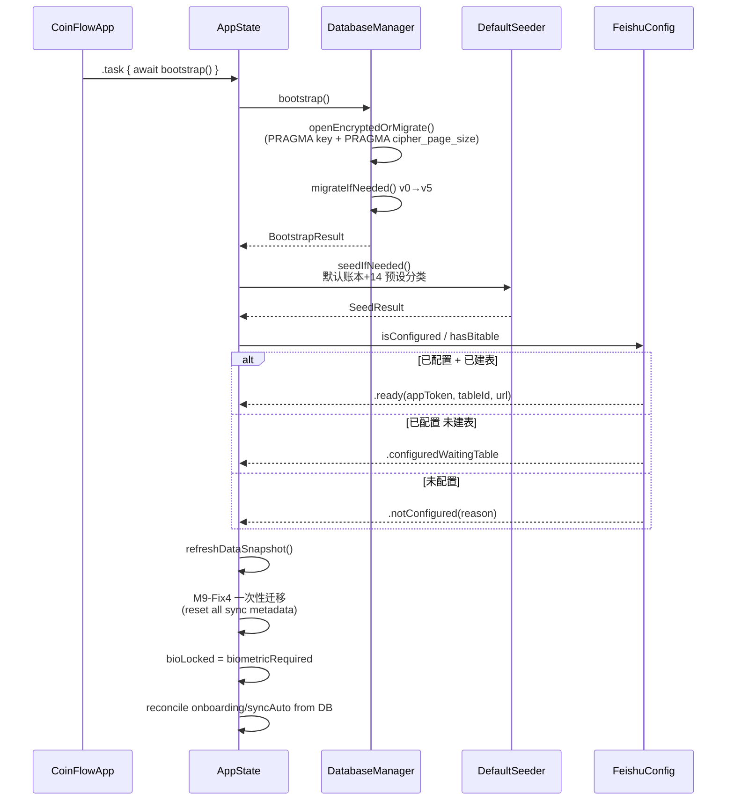

**关键约束**：
1. `PRAGMA key` 必须是开库后的第一条 SQL，否则 SQLCipher 视为未加密库
2. `cipher_page_size = 4096`（SQLCipher 4 默认值，向前兼容）
3. 第一次 `PRAGMA key` 后通过 `SELECT count(*) FROM sqlite_master` 探测密钥是否匹配；不匹配（M1 旧未加密库残留）→ 删文件重建
4. DB 失败 → 后续步骤全部跳过，UI 进入降级模式

---

### 2.2 关键功能模块的交互流程

#### 2.2.1 手动新建账单（最简路径）

```
用户点首页"+" / Tab 中央按钮 / 长按 Home Quick Action
        │
        ▼
NewRecordModal（金额 + 分类 + 备注 + 日期）
        │ commit
        ▼
NewRecordViewModel.save()
        │
        ▼
SQLiteRecordRepository.insert(record)  → SQLite (sync_status='pending')
        │
        ├── RecordChangeNotifier.broadcast()  → UI 自动刷新（流水/统计）
        │
        └── SyncTrigger.fire(reason: "newRecord")
                │
                ▼
            Task.detached { await SyncQueue.shared.tick(...) }
                │
                ▼  （见 §2.3.1 同步链路）
            飞书 createRecord → markSynced + remoteId 回写
```

#### 2.2.2 截图 OCR 记账

```
入口（两条）：
  1. 首页/流水页相机按钮 → PhotosPicker
  2. iOS 系统 Back Tap → Shortcuts → CoinFlowCaptureIntent → 剪贴板打时间戳
        → App 回前台 100ms → ScreenshotInbox.tryConsumePasteboardImage
        → MainTabView 根层 imageSubject 订阅（任意 Tab 都能接收）

→ CaptureConfirmView 接图
→ OCRRouter.route(image:)
   ├─ 档 1：Vision 本地（confidence ≥ 0.6 且 amount 已识别 → 直接用）
   └─ 档 2：LLM 视觉（QuotaService 月度上限内）→ BillsLLMParser.parse(source:.ocr)

→ 分叉：
   ├─ LLM 配置 + rawText 非空 → OCRWizardContainerView
   │       （复用 VoiceWizardViewModel.startFromOCRText 的 wizard/summary 链路）
   │       支持 1 张截图多笔账单
   └─ 否则 → CaptureConfirmView 单笔模式

→ 用户逐笔确认 / 跳过 / 回跳编辑
→ VoiceWizardViewModel.finalizeAllToDatabase(...)
→ RecordRepository 批量 insert
→ 同步链路（同 2.2.1 末尾）
```

**附件归档（M9-Fix4）**：截图 jpeg 落 `ScreenshotStore`（`Caches/`），同步成功后通过 `FeishuBitableClient.uploadAttachment` 上传到飞书素材库，写回 `attachment_remote_token` 后删除本地文件，云端 `file_token` 即唯一权威副本。

#### 2.2.3 语音多笔记账（M5 核心链路）

详细 7-phase 状态机见 [§3.3.2](#332-voicewizardviewmodel-7-phase-状态机)。

```
VoiceRecordingSheet（半屏 .medium detent）
  按住 → AudioRecorder.start()  AAC-LC 16kHz mono → NSTemporaryDirectory
  松开 → AudioRecorder.stop()   立即即用即删
        ↓
ASRRouter.transcribe
  ├─ local : SFSpeechRecognizer 强制 onDevice
  └─ cloud : StubCloudASRBackend（M6 计划真实后端；阿里一句话已被 M6-Fix 移除）
        ↓
BillsLLMParser.parse(asrText, allowedCategories, requiredFields)
  ├─ LLM 已配置 → OpenAICompatibleLLMClient（严格 JSON mode）
  │       ↓ 失败降级
  └─ 规则引擎：12 预设分类词典 + 中文数字"一千二" + 自然语言日期 + 未来日期拦截
        ↓
VoiceWizardViewModel（idle → recording → asr → parsing → wizard → summary）
  - 每次 phase 切换 UPDATE voice_session
  - 逐笔 wizard：confirmedIds / skippedIds 记录状态，**不立即入库**
  - 进度点支持 jumpTo(index:) 回跳任意笔
  - commitCurrentEdits()：跳转前先回写当前编辑
        ↓
VoiceSummaryView "查看流水"
  → finalizeAllToDatabase()  统一 RecordRepository.insert
  → 同步链路
```

#### 2.2.4 LLM 账单总结（M10）

```
触发源：
  ├─ 用户主动：设置 → 账单总结 → 周报/月报/年报按钮
  └─ Scheduler：scenePhase==.active 时检查"今天是周一/月1/年1/1"
                + UserDefaults 节流（每天最多一次）
        ↓
BillsSummaryService.generate(kind, force:false)  [actor 串行同 kind]
  ├─ 取最近 3 条历史 digest
  ├─ Aggregator.aggregate → snapshot（按 category/direction 聚合）
  ├─ 阈值检查（force=false）：周≥3 / 月≥5 / 年≥12
  ├─ PromptBuilder.build → (system, user)  [system 来自 Resources/Prompts/*.md]
  ├─ LLMClient.complete  [stream=false / temp=0.8 / max_tokens=4000]
  ├─ stripMarkdownCodeFence + extractDigest（≤30 字）
  ├─ Repository.upsert（按 kind+period_start 去重）
  ├─ NotificationCenter.post(.billsSummaryDidGenerate, summary)  [@MainActor]
  │     ↓
  │   AppState.pendingSummaryPush = summary  ← 跨 Tab 保活
  │     ↓
  │   HomeMainView .safeAreaInset → BillsSummaryPushBanner
  └─ Task.detached → syncToFeishu()
       FeishuBitableClient.ensureSummaryBitableExists() → createSummaryRecord
```

#### 2.2.5 跨 Tab 通信策略

| 场景 | 机制 | 文件 |
|---|---|---|
| 流水页"+" → 切首页打开新建 Modal | `MainCoordinator.pendingAction` | `Features/Common/MainCoordinator.swift` |
| 截图剪贴板事件 → 任意 Tab 都能接收 | `ScreenshotInbox.imageSubject`（Combine PassthroughSubject）+ MainTabView 根层订阅 | `Features/Capture/ScreenshotInbox.swift` |
| LLM 总结生成 → 首页 banner | `NotificationCenter` + `AppState.pendingSummaryPush` | `App/AppState.swift:summaryGenerateObserver` |
| 数据变更 → 各 ViewModel 刷新 | `RecordChangeNotifier`（Combine Subject 单例） | `Data/Repositories/RecordChangeNotifier.swift` |
| 配置变更 → SystemConfigView 刷新 | `SystemConfigStore.didChangeNotification` | `Config/SystemConfigStore.swift` |
| 飞书 bitable 元数据变更 | `FeishuConfig.bitableMetadataDidChange` | `Data/Feishu/FeishuConfig.swift` |

---

### 2.3 网络请求与数据流处理

#### 2.3.1 飞书同步链路（写云）

CoinFlow 仅一处发起业务网络请求：飞书多维表格。所有调用经 `FeishuBitableClient`（actor）串行化。

**核心 HTTP 流程**（`callAPIInternal`）：

```
[业务调用]
   │
   ▼
FeishuTokenManager.getToken()  [actor]
   ├─ 内存 token 未过期 → 直接返回
   └─ 否则：POST /open-apis/auth/v3/tenant_access_token/internal
            { app_id, app_secret } → tenant_access_token (有效期 ~2h)
            过期前 5min 主动刷新
   │
   ▼
URLSession.data(for: URLRequest)
   - Authorization: Bearer {tenant_access_token}
   - Content-Type: application/json; charset=utf-8
   - timeoutInterval: 15s（附件上传放宽到 30s）
   │
   ▼
HTTP Status 检查
   ├─ 401/403（非首次重试）→ tokenManager.invalidateAndRefresh + 重试 1 次
   ├─ < 200 / >= 300 → throw httpStatus(code, body)
   └─ 2xx：解析飞书统一壳 {code, msg, data}
            ├─ code==99991663（token 即将失效）→ 同上刷新重试
            ├─ code != 0 → throw apiError(code, msg, raw)
            └─ code == 0 → 返回 data 字典
```

**HTTP API 矩阵**：

| 业务能力 | Method | 路径 | 备注 |
|---|---|---|---|
| 获取 tenant_access_token | POST | `/open-apis/auth/v3/tenant_access_token/internal` | actor 内存缓存，5min 提前刷新 |
| 通过 Wiki 节点取 obj_token | GET | `/open-apis/wiki/v2/spaces/get_node?token=...` | Wiki 模式 bootstrap 用 |
| 创建多维表格 | POST | `/open-apis/bitable/v1/apps` | 自动建表模式 |
| 列字段 / 增字段 / 改字段 / 删字段 | GET/POST/PUT/DELETE | `/open-apis/bitable/v1/apps/{appToken}/tables/{tableId}/fields(/<fieldId>)` | bootstrap |
| 创建记录 | POST | `.../tables/{tableId}/records` | `record.remoteId == nil` 走此路径 |
| 更新记录 | PUT | `.../records/{recordId}` | 含软删（"已删除"打勾） |
| 搜索记录（分页） | POST | `.../records/search?page_size=...` | 必须 POST 带 body（即使 `{}`） |
| 批量删除 | POST | `.../records/batch_delete` | `["records": [...recordIds]]`，≤500/批 |
| 上传素材（截图） | POST multipart | `/open-apis/drive/v1/medias/upload_all` | parent_type=`bitable_image` |
| 取临时下载 URL | GET | `/open-apis/drive/v1/medias/batch_get_tmp_download_url?file_tokens=...` | 5min 有效 |
| 添加协作者 | POST | `/open-apis/drive/v1/permissions/{appToken}/members?type=bitable` | 给 owner 加 `full_access` |

#### 2.3.2 同步队列（`SyncQueue` actor）

完整状态机见 [§3.3.1](#331-record-同步状态机)。

**关键策略**：

| 维度 | 策略 |
|---|---|
| **批次大小** | 单 tick 100 条；超出留下次 |
| **最大重试** | `attempts` 上限 5；达到即"已死"，需用户手动 `resetDeadRetries()` 复活 |
| **退避** | 指数 `1, 2, 4, 8, 16, 32 s`，上限 60 s，±20% 抖动，最小 100ms 保护 |
| **错误分类** | `FeishuBitableError.isTransient`：网络/5xx/429/code 99991663/9499 → transient（attempts+1）；4xx/notConfigured/decode → permanent（attempts 跳到 maxAttempts 立即 dead） |
| **启动 reconcile** | tick 入口先把上次 crash 残留的 `syncing` 复活为 `pending` |
| **FIFO 真实序** | `pendingSync` 按 `updated_at ASC` 排序；同步元操作（markSyncing/markSynced/markFailed）绝不污染 `updated_at` |
| **降级策略** | `1254043 RecordIdNotFound`（remoteId 失效）→ create 兜底；`1002/91402 NotExist`（app_token 失效）→ 清缓存 + 重建表 + 重试 1 次 |

#### 2.3.3 反向同步（手动拉取）

```
SyncStatusView "从飞书拉取"
   ↓
AppState.pullFromFeishu()
   ↓
RemoteRecordPuller.pullAll(defaultLedgerId)
   ├─ FeishuBitableClient.searchAllRecords()  分页 200/页
   ├─ for each FeishuRemoteRow:
   │     └─ RecordBitableMapper.decode(fields) → Record
   ├─ 本地 id 已存在 → 跳过（不覆盖本地未推送的编辑）
   └─ 本地缺失 → INSERT (syncStatus=.synced)
   ↓
PullResult { inserted, skippedExisting, decodeFailures }
```

**为什么手动拉取而非实时推送？** 飞书 Open API 没有客户端级 WebHook 或 Push 推送通道；轮询代价高且无意义（账单写入频次低）。

#### 2.3.4 OCR / ASR / LLM 网络调用

| 链路 | 触发时机 | Provider 选择 | 失败降级 |
|---|---|---|---|
| OCR 视觉 LLM | 截图记账 + Vision 不达标 | `LLM_Vision_Provider` | 退到 Vision 本地 + 规则解析 |
| LLM 文本（语音多笔/OCR rawText） | 语音录完 / OCR LLM 拿到 rawText | `LLM_Text_Provider` | 规则引擎（中文数字/日期解析/分类词典） |
| LLM 总结 | M10 周/月/年触发 | `LLM_Summary_Provider` | 失败：summary status=`failed`，UI 显示重试按钮 |

所有 LLM 调用统一走 `LLMTextClient.OpenAICompatibleLLMClient`，使用 OpenAI Chat Completions 兼容协议；强制 JSON mode（`response_format: { type: "json_object" }`）。

---

### 2.4 UI 与业务逻辑的交互关系

#### 2.4.1 数据流（单向）

```
        用户操作
           │
           ▼
       [View]
           │ 调用 ViewModel 方法
           ▼
     [ViewModel]
           │ 调用 Repository
           ▼
    [Repository]
           │ SQL（参数化）
           ▼
    [SQLite/SQLCipher]
           │ 持久化
           ▼
[RecordChangeNotifier].broadcast()
           │
           ▼
        所有订阅 ViewModel
           │ 自动刷新 @Published
           ▼
        [View 自动重渲染]
           │
           ▼
   [SyncTrigger.fire]
           │ Task.detached
           ▼
     [SyncQueue.tick] ←──── 飞书 HTTP ────→ [Feishu Bitable]
           │
           ▼
[markSynced + remoteId 回写]
           │
           ▼
        UI 静默更新（不阻塞）
```

#### 2.4.2 ViewModel 列表

| ViewModel | 所属 View | 关键 `@Published` | 业务方法 |
|---|---|---|---|
| `NewRecordViewModel` | NewRecordModal | `amount/category/note/date` | `save()` |
| `RecordDetailViewModel` | RecordDetailSheet | `editable record` | `commit() / softDelete()` |
| `RecordsListViewModel` | RecordsListView | `records / month / search` | `loadByMonth() / searchInline()` |
| `VoiceWizardViewModel` | VoiceRecordingSheet → VoiceWizardContainerView | `phase / bills / currentIndex / currentBill / confirmedIds / skippedIds` | `startRecording / stopRecordingAndProcess / confirmCurrent / skipCurrent / jumpTo / finalizeAllToDatabase / startFromOCRText` |
| `StatsViewModel` | StatsHubView / StatsMainView | `kpi / categoryAgg / trend` | `recompute()` |
| `BillsSummaryService`（actor） | BillsSummaryListView / Banner | `inflight[kind]` | `generate / syncToFeishu` |

#### 2.4.3 主题与可访问性

- 全局 `.preferredColorScheme(.dark)`（设计基线为深色）
- 所有 Color 走 `NotionColor.*` 语义 token（`text_primary` / `surface_overlay` / `accent_blue` / `divider` / `border` ...），自动适配深浅色
- 字体走 `NotionTheme.title()/h1()/h2()/h3()/body()/small()/micro()` token
- 间距/圆角走 `NotionTheme.space*` / `radius{SM,MD,LG,XL}`
- 动效走 `Motion.respect(_)` 包裹器，自动响应"减少动效"系统辅助选项

---

## 三、可视化设计文档

### 3.1 核心模块 UML 类图

#### 3.1.1 应用启动与全局状态

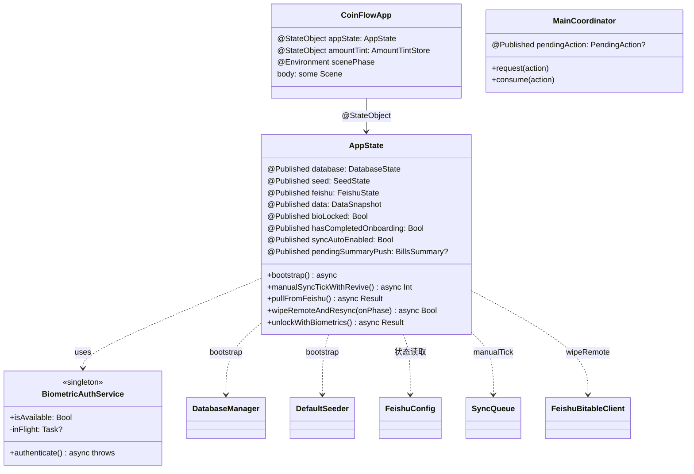

#### 3.1.2 数据层（Repository + Database）

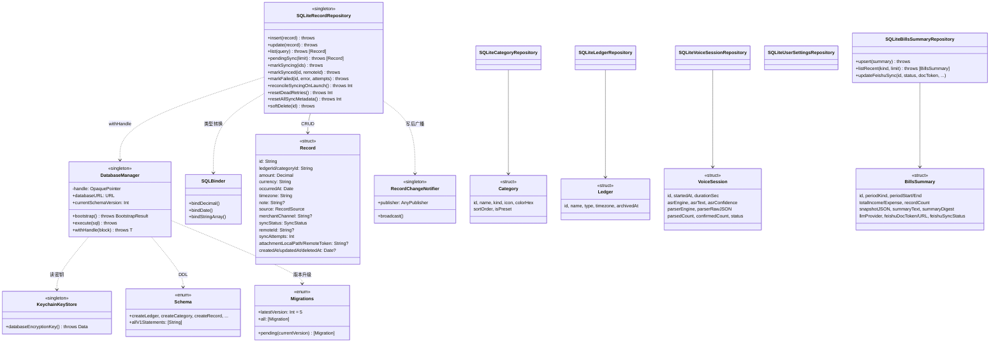

#### 3.1.3 同步与飞书层

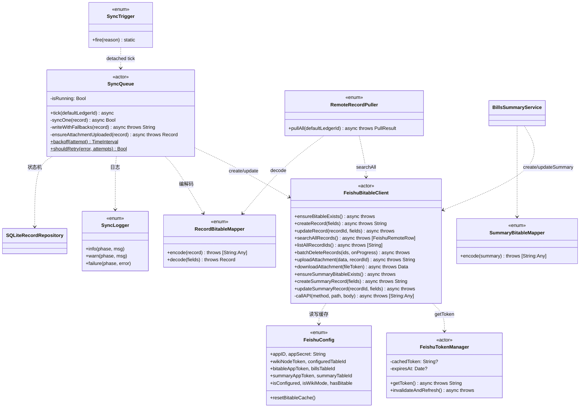

#### 3.1.4 OCR 与语音（领域能力层）

```mermaid
classDiagram
    class OCRRouter {
        <<MainActor>>
        -vision: VisionOCRBackend
        -llm: OCRBackend
        -quota: QuotaService
        +route(image) async RouteResult
    }
    class OCRBackend {
        <<protocol>>
        recognize(image) async throws ParsedReceipt
    }
    class VisionOCRBackend {
        // Apple Vision
    }
    class StubLLMOCRBackend
    class ReceiptParser {
        +parse(rawText) ParsedReceipt
    }
    class QuotaService {
        +canUse(engine) Bool
        +increment(engine)
    }
    class ScreenshotInbox {
        <<singleton>>
        +imageSubject: PassthroughSubject
        +tryConsumePasteboardImage()
    }
    class CoinFlowCaptureIntent {
        <<AppIntent>>
        +perform() async
    }

    class AudioRecorder {
        +start() throws
        +stop() throws (URL, TimeInterval)
        +cancel()
        +cleanup()
        +level/isRecording
    }
    class ASREngine {
        <<protocol>>
    }
    class LocalASRBackend {
        // SFSpeech onDevice
    }
    class StubCloudASRBackend
    class ASRRouter {
        <<singleton>>
        +transcribe(audioURL) async RouteResult
    }
    class BillsLLMParser {
        +parse(asrText, allowed, required, source) async ParseResult
    }
    class LLMTextClient {
        <<protocol>>
    }
    class OpenAICompatibleLLMClient
    class BillsVisionLLMClient
    class BillsPromptBuilder
    class BillsVoicePromptBuilder
    class BillsOCRPromptBuilder
    class ParsedBill {
        <<struct>>
        id, occurredAt, amount, direction
        categoryName, note, missingFields
    }
    class VoiceWizardViewModel {
        @Published phase, bills, currentIndex
        @Published currentBill, confirmedIds, skippedIds
        +startRecording / stopRecordingAndProcess
        +startFromOCRText
        +confirmCurrent / skipCurrent / jumpTo
        +finalizeAllToDatabase
    }

    OCRRouter ..> VisionOCRBackend
    OCRRouter ..> StubLLMOCRBackend
    OCRRouter ..> QuotaService
    OCRBackend <|.. VisionOCRBackend
    OCRBackend <|.. StubLLMOCRBackend
    OCRRouter ..> ReceiptParser : 兜底

    ASREngine <|.. LocalASRBackend
    ASREngine <|.. StubCloudASRBackend
    ASRRouter ..> LocalASRBackend
    ASRRouter ..> StubCloudASRBackend

    VoiceWizardViewModel ..> AudioRecorder
    VoiceWizardViewModel ..> ASRRouter
    VoiceWizardViewModel ..> BillsLLMParser
    VoiceWizardViewModel ..> SQLiteRecordRepository
    VoiceWizardViewModel ..> SQLiteVoiceSessionRepository
    VoiceWizardViewModel --> ParsedBill : bills

    BillsLLMParser ..> OpenAICompatibleLLMClient
    BillsLLMParser ..> BillsPromptBuilder
    BillsPromptBuilder ..> BillsVoicePromptBuilder
    BillsPromptBuilder ..> BillsOCRPromptBuilder
    LLMTextClient <|.. OpenAICompatibleLLMClient
```

---

### 3.2 主要业务时序图

#### 3.2.1 App 启动 → 进入主界面

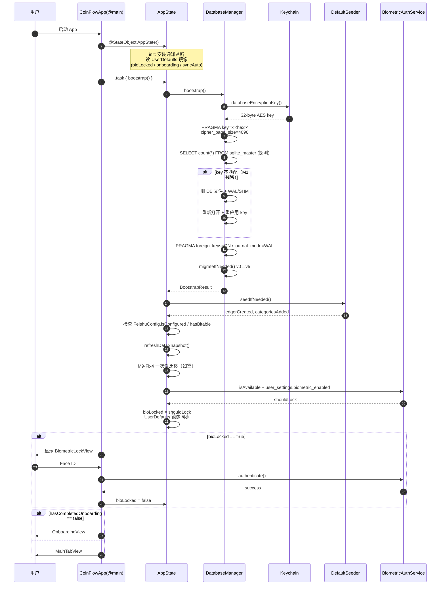

#### 3.2.2 创建账单 → 飞书同步成功

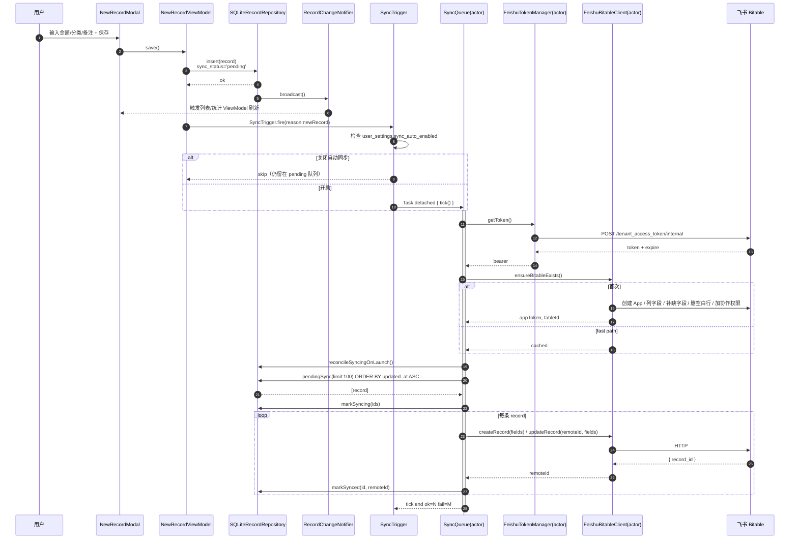

#### 3.2.3 截图记账（多笔 LLM 解析）

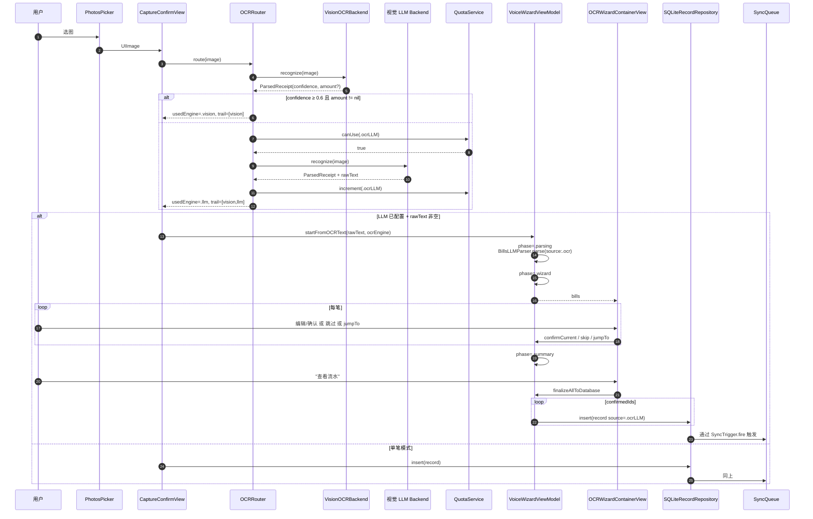

#### 3.2.4 LLM 账单总结生成与推送

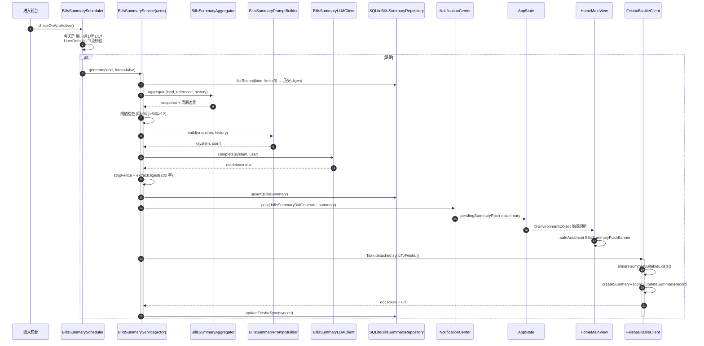

---

### 3.3 状态转换图

#### 3.3.1 Record 同步状态机

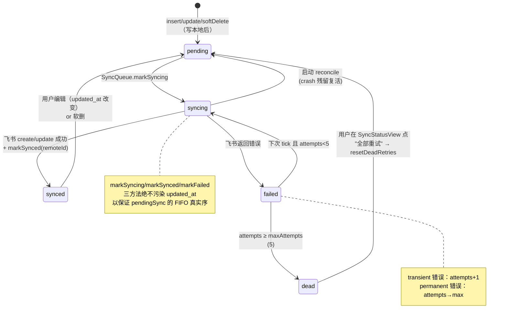

#### 3.3.2 VoiceWizardViewModel 7-phase 状态机

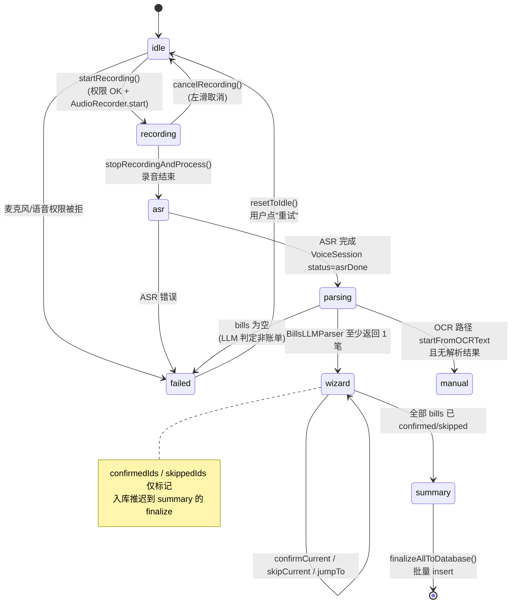

#### 3.3.3 飞书 Bitable Bootstrap 状态

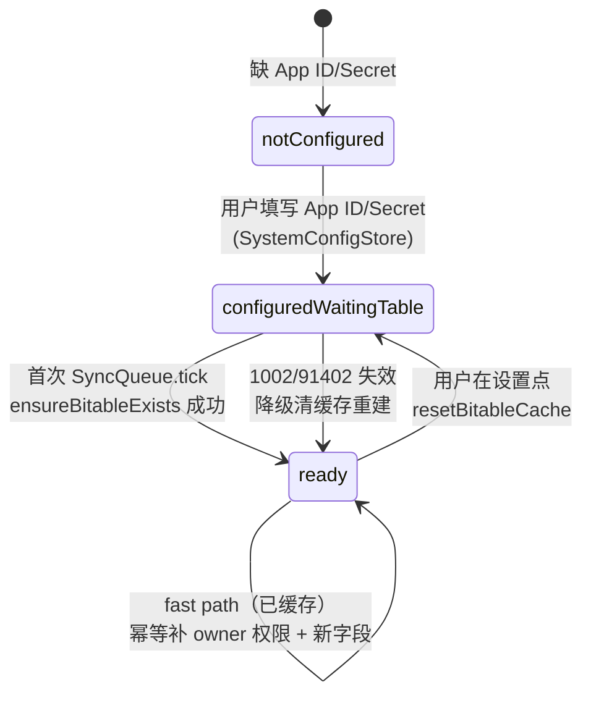

#### 3.3.4 「清空云端并重新同步」进度状态

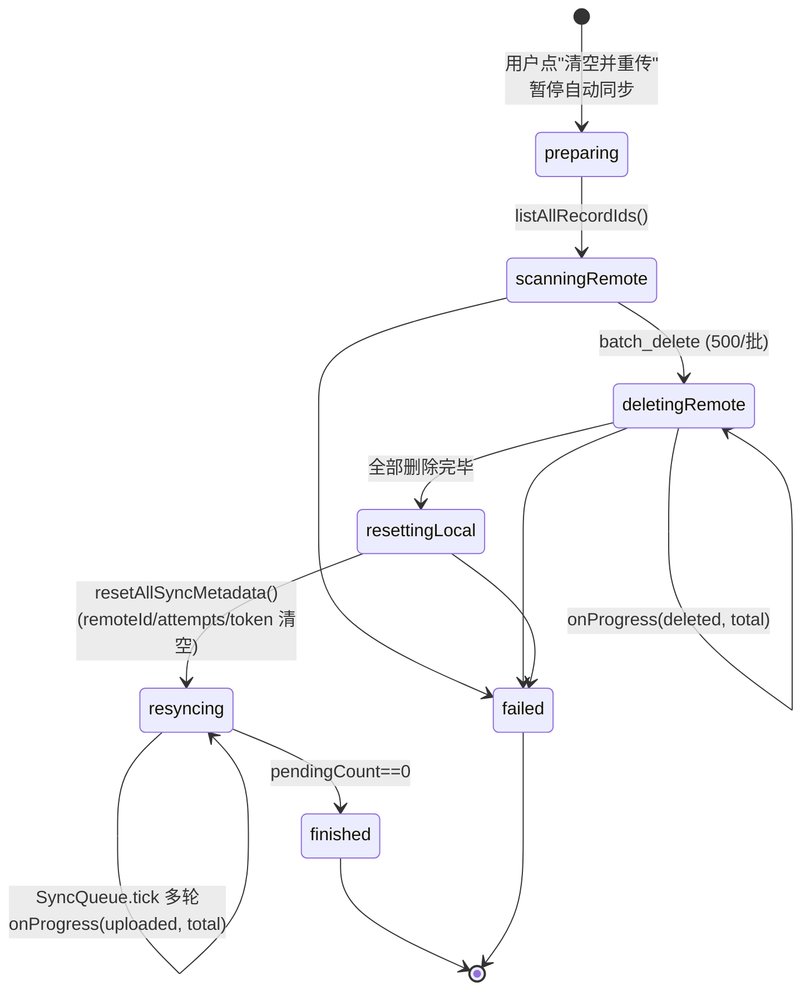

---

## 四、数据结构设计

### 4.1 本地数据存储方案

#### 4.1.1 选型理由：SQLCipher 4 + Keychain

| 候选 | 选型结论 |
|---|---|
| **CoreData** | ❌ 复杂表关系迁移成本高；与 SwiftUI 集成需 `@FetchRequest`，难以脱离 View 层做单元测试；不支持透明加密 |
| **Realm** | ❌ 引入 ~10MB 二进制依赖；个人项目不必要 |
| **GRDB.swift** | ⚠️ 优秀但偏重；学习曲线高于直接 sqlite3 + 薄封装 |
| **SQLCipher 4 + 直接 sqlite3 API** | ✅ **最终选择**：透明 256-bit AES 加密；性能与原生 SQLite 接近；可控性最高；测试 mock 简单 |

**密钥管理**：
- 256-bit 随机字节，存 Keychain `kSecAttrAccessibleAfterFirstUnlockThisDeviceOnly`（首次解锁后可读，不跨设备同步）
- `PRAGMA key = "x'<hex>'";` 是开库后的第一条 SQL（必须）
- `PRAGMA cipher_page_size = 4096`（SQLCipher 4 默认值，向前兼容）

#### 4.1.2 数据库文件位置

```
<App Support>/CoinFlow/coinflow.sqlite       // 主库
<App Support>/CoinFlow/coinflow.sqlite-wal   // WAL
<App Support>/CoinFlow/coinflow.sqlite-shm
<Library/Caches>/Screenshots/<recordId>.jpg  // OCR 截图（同步成功后系统可清）
```

#### 4.1.3 完整 Schema（v5）

> 所有 DDL 集中在 [`CoinFlow/Data/Database/Schema.swift`](./CoinFlow/CoinFlow/Data/Database/Schema.swift)。

##### `ledger` 账本

| 列 | 类型 | 说明 |
|---|---|---|
| `id` | TEXT PK | UUID |
| `name` | TEXT NOT NULL | |
| `type` | TEXT NOT NULL | `personal` / `shared`(V2) |
| `firestore_path` | TEXT | M8 残留字段，M9 后 NULL |
| `created_at` | INTEGER NOT NULL | UTC 秒 |
| `timezone` | TEXT NOT NULL | IANA |
| `archived_at` / `deleted_at` | INTEGER | |

##### `category` 分类

| 列 | 类型 | 说明 |
|---|---|---|
| `id` | TEXT PK | UUID |
| `name` | TEXT NOT NULL | |
| `kind` | TEXT NOT NULL | `expense` / `income` |
| `icon` | TEXT NOT NULL | SF Symbol name |
| `color_hex` | TEXT NOT NULL | Notion 调色板 hex |
| `parent_id` | TEXT | V2 二级分类预留 |
| `sort_order` | INTEGER DEFAULT 0 | |
| `is_preset` | INTEGER DEFAULT 0 | 1 = 14 预设分类，不可删 |
| `deleted_at` | INTEGER | |

##### `record` 流水（核心表）

| 列 | 类型 | 约束 / 说明 |
|---|---|---|
| `id` | TEXT PK | UUID（业务主键 = 飞书记录的「单据ID」列） |
| `ledger_id` | TEXT NOT NULL | FK → ledger.id |
| `category_id` | TEXT NOT NULL | FK → category.id |
| `amount` | TEXT NOT NULL | `Decimal` 字符串；禁用 Double |
| `currency` | TEXT NOT NULL DEFAULT 'CNY' | ISO 4217 |
| `occurred_at` | INTEGER NOT NULL | UTC 秒 |
| `timezone` | TEXT NOT NULL | IANA |
| `note` | TEXT | 账单描述（写入飞书主键列） |
| `payer_user_id` | TEXT | AA 账本（V2） |
| `participants` | TEXT | JSON array（AA） |
| `source` | TEXT NOT NULL | `RecordSource` enum |
| `ocr_confidence` | REAL | 非 manual 时有值 |
| `voice_session_id` | TEXT | FK → voice_session.id |
| `missing_fields` | TEXT | JSON array |
| `merchant_channel` | TEXT | M9-Fix5：微信/支付宝/抖音/银行/其他 |
| `sync_status` | TEXT DEFAULT 'pending' | `pending/syncing/synced/failed` |
| `remote_id` | TEXT | 飞书 record_id |
| `last_sync_error` | TEXT | |
| `sync_attempts` | INTEGER DEFAULT 0 | 上限 5 |
| `attachment_local_path` | TEXT | M9-Fix4：OCR 截图本地路径 |
| `attachment_remote_token` | TEXT | M9-Fix4：飞书素材 file_token |
| `created_at` / `updated_at` | INTEGER NOT NULL | UTC 秒 |
| `deleted_at` | INTEGER | 软删除 |

**索引**：
- `idx_record_ledger_time(ledger_id, occurred_at DESC) WHERE deleted_at IS NULL` —— 流水列表主路径
- `idx_record_sync_status(sync_status) WHERE sync_status IN ('pending','failed')` —— 同步队列扫描

##### `voice_session` 语音会话日志

字段：`id / started_at / duration_sec / audio_path / asr_engine / asr_text / asr_confidence / parser_engine / parser_raw_json / parsed_count / confirmed_count / status / error / created_at`

特殊：**不带 `deleted_at`**，用 `status='cancelled'` 表达"终止"语义。

##### `quota_usage` LLM/OCR 月度配额

主键 `(month, engine)`；每月归零；RMW 两步事务 + `BEGIN IMMEDIATE` 防并发丢增量。

##### `user_settings` KV 配置

`key TEXT PK / value TEXT / updated_at INTEGER`；存：
- `biometric.enabled` / `onboarding.completed` / `sync.auto_enabled`
- `voice.required_fields`（JSON array）
- `firstLaunchDate`
- 外观偏好等

##### `bills_summary` LLM 账单总结（M10）

| 列 | 说明 |
|---|---|
| `id` PK | UUID |
| `period_kind` | `week` / `month` / `year` |
| `period_start` / `period_end` | 周期边界（毫秒 epoch） |
| `total_expense` / `total_income` | Decimal 字符串 |
| `record_count` | 周期内未删账单笔数 |
| `snapshot_json` | 喂给 LLM 的统计快照（重新生成复用） |
| `summary_text` | LLM 完整 markdown |
| `summary_digest` | ≤30 字核心洞察（喂下次 LLM 做对比） |
| `llm_provider` | `modelscope` / `deepseek` / ... |
| `feishu_doc_token` / `feishu_doc_url` | 飞书 record_id + URL |
| `feishu_sync_status` | `pending/synced/failed/skipped` |
| `feishu_last_error` | |
| `created_at` / `updated_at` / `deleted_at` | |

唯一索引 `(period_kind, period_start)`；**完整 unique index 而非 partial**（SQLite ON CONFLICT 不识别 partial）。

#### 4.1.4 Repository 层关键约定

- 所有 SQL **100% 参数化**（`sqlite3_bind_*`），动态列名走 `precondition` 白名单
- `SQLBinder` 统一类型互转：`Decimal ↔ TEXT` / `Date ↔ INTEGER 秒` / `[String] ↔ JSON TEXT`
- 软删默认在 `list` 中过滤；提供 `includesDeleted` 参数显式包含
- 同步状态三方法（`markSyncing/markSynced/markFailed`）**不污染 `updated_at`**
- 写后通过 `RecordChangeNotifier.broadcast()` 触发 UI 与同步联动

---

### 4.2 网络接口数据模型

#### 4.2.1 飞书多维表格"账单"主表 Schema

CoinFlow 在飞书侧建立的 13 字段表（[`FeishuFieldName`](./CoinFlow/CoinFlow/Data/Feishu/FeishuBitableClient.swift) 字段名常量）：

| 字段（中文） | 飞书 type | 对应 Record 字段 | 备注 |
|---|---|---|---|
| `账单描述`（主键） | 1 文本 | `note` | 用户在飞书一眼看懂 |
| `渠道` | 3 单选 | `merchantChannel` | 微信/支付宝/抖音/银行/其他 |
| `单据ID` | 1 文本 | `id` | UUID 业务主键 |
| `日期` | 5 日期时间 | `occurredAt` | |
| `金额` | 2 数字 | `amount` | |
| `货币` | 3 单选 | `currency` | CNY/USD/HKD/EUR/JPY |
| `收支` | 3 单选 | `category.kind` 派生 | 支出/收入 |
| `分类` | 1 文本 | `category.name` | 跨用户名字一致 |
| `来源` | 3 单选 | `source` | 手动/截图OCR-*/语音-* |
| `附件` | 17 附件 | `attachmentRemoteToken` | OCR 截图归档 |
| `创建时间` | 5 日期时间 | `createdAt` | `auto_fill=false` |
| `更新时间` | 5 日期时间 | `updatedAt` | `auto_fill=false` |
| `已删除` | 7 复选框 | `deletedAt != nil` | 软删 = 打勾 |

#### 4.2.2 飞书"账单总结"独立表 Schema（M10）

12 字段（[`FeishuSummaryFieldName`](./CoinFlow/CoinFlow/Data/Feishu/FeishuBitableClient.swift)）：

| 字段 | type | 说明 |
|---|---|---|
| `周期标签`（主键） | 1 | "2026-W19" / "2026-05" / "2026" |
| `总结ID` | 1 | UUID = `bills_summary.id` |
| `周期类型` | 3 | 周报/月报/年报 |
| `起始日期` / `结束日期` | 5 | |
| `总收入` / `总支出` | 2 | |
| `笔数` | 2 | |
| `一句话洞察` | 1 | LLM digest |
| `完整总结` | 1 | LLM markdown |
| `LLM模型` | 1 | provider 名 |
| `生成时间` | 5 | |

#### 4.2.3 字段双向 Mapper

- [`RecordBitableMapper`](./CoinFlow/CoinFlow/Data/Sync/RecordBitableMapper.swift)：`Record → [String:Any]`（`encode`）+ `[String:Any] → Record`（`decode`）
  - 处理：Decimal → Double（飞书数字字段强类型）、Date → 毫秒、`source` 中文映射、附件 attachment 数组结构 `[{"file_token":"..."}]`
- [`SummaryBitableMapper`](./CoinFlow/CoinFlow/Data/Sync/SummaryBitableMapper.swift)：仅 `encode`（M10 不做反向同步）

#### 4.2.4 LLM 协议（统一 OpenAI 兼容）

```jsonc
// Request: POST {baseURL}/chat/completions
{
  "model": "<model id>",
  "messages": [
    {"role": "system", "content": "<system prompt>"},
    {"role": "user",   "content": "<asr/ocr text 或多模态 content array>"}
  ],
  "temperature": 0.0,        // 解析（追求确定性）
  // "temperature": 0.8,     // 总结（情绪化）
  "max_tokens": 2000,        // 4000 for 总结
  "stream": false,
  "response_format": { "type": "json_object" }   // 仅解析路径
}

// 业务 JSON 协议（解析路径）
{
  "bills": [
    {
      "occurred_at": "2026-05-12",
      "amount": "12.50",
      "direction": "expense",
      "category": "餐饮",
      "note": "中午吃面",
      "missing_fields": []
    }
  ]
}
```

兜底：`content` 为 null 时降级取 `reasoning_content`（modelscope Kimi-K2.5 的特殊响应字段）。

---

### 4.3 缓存数据结构与持久化策略

| 缓存类型 | 介质 | Key | 失效策略 |
|---|---|---|---|
| 飞书 `tenant_access_token` | 内存（`FeishuTokenManager` actor） | – | 过期前 5min 刷新；401/403/code 99991663 强制 invalidate |
| 飞书 `app_token` / `table_id` / `bitableURL` | UserDefaults | `feishu.bitable.app_token` 等 | `resetBitableCache()` 或失效降级 |
| 飞书 summary `app_token` / `table_id` | UserDefaults | `feishu.summary_bitable.*` | `resetSummaryBitableCache()` |
| 启动早期状态镜像 | UserDefaults | `onboarding.completed_mirror` / `security.biometric_enabled_mirror` / `sync.auto_enabled_mirror` | bootstrap 后从 DB reconcile |
| OCR 截图 jpeg | 文件系统 `Caches/Screenshots/` | 文件名 `<recordId>.jpg` | 同步成功上传飞书素材后立即删除（云端 file_token 为唯一权威） |
| 飞书附件下载缓存 | `RemoteAttachmentLoader` 内存 + 文件 | file_token | 详情页查看时按需拉，临时 URL 5min 有效 |
| LLM/OCR 月度配额 | SQLite `quota_usage` | `(month, engine)` | 每月归零；用户切月触发 |
| 默认 ledger / category 已 seed 标记 | `user_settings` | `seed.default_ledger_done` / `seed.preset_categories_done` | `seedIfNeeded` 幂等 |

**为什么镜像到 UserDefaults？**
`AppState` 的 `@Published` 属性默认值会在 `DatabaseManager.bootstrap()` 之前求值，此时 SQLite 还未就绪。从 `user_settings` 直接读会失败回退到 default，覆盖用户上次的真实选择。镜像策略：写时双写（DB 权威 + UD 镜像），读时优先 UD（启动期）→ DB 就绪后 reconcile 一次。

---

### 4.4 数据迁移与版本管理

#### 4.4.1 版本号机制

通过 SQLite 内建的 `PRAGMA user_version` 持久化当前 schema 版本：
- 启动后读 `user_version`
- `Migrations.pending(currentVersion)` 返回所有 `version > current` 的迁移
- 按版本号升序在事务内执行：`BEGIN → 全部语句 → PRAGMA user_version=N → COMMIT`
- 失败 `ROLLBACK` 并抛错；DB 进入 `failed` 状态

#### 4.4.2 已发布迁移序列（截至 v5）

| 版本 | 发布里程碑 | 内容 |
|---|---|---|
| **v1** | M1 | 初始建表：ledger / category / record / quota_usage / user_settings / voice_session + 三个索引 |
| **v2** | M9-Fix4 | `record` 增 `attachment_local_path` / `attachment_remote_token`（OCR 截图归档） |
| **v3** | M9-Fix5 | `record` 增 `merchant_channel`（OCR 渠道单独列） |
| **v4** | M10 | 新增 `bills_summary` 表 + `idx_bills_summary_period` |
| **v5** | M10-Fix1 | 修复 v4 写错的 partial unique index：`DROP` 后重建为完整 unique index（SQLite `ON CONFLICT` 不能识别 partial 索引导致 upsert 失败） |

#### 4.4.3 迁移幂等性策略

```swift
struct Migration {
    let version: Int
    let description: String
    let statements: [String]
    let tolerateDuplicateColumn: Bool   // ALTER ADD COLUMN 容错
}
```

- 所有 DDL 用 `IF NOT EXISTS`
- `ALTER TABLE ADD COLUMN` 在 `tolerateDuplicateColumn=true` 时允许"duplicate column name"错误幂等跳过（应对 dev 模拟器重装、测试环境状态污染等脏环境）
- `DROP INDEX IF EXISTS`（v5 用于先删旧 partial 索引）

#### 4.4.4 加密库迁移（M1 → M3）

`DatabaseManager.openEncryptedOrMigrate` 处理历史 M1 未加密 DB：
1. 打开句柄 + `PRAGMA key`
2. 探测 `SELECT count(*) FROM sqlite_master`
3. 失败（"file is not a database"）→ 视为未加密残留，删 DB + WAL/SHM → 重新打开

> **当前 MVP 无线上用户，直接删除重建即可**；线上版本如出现该路径需升级为"读旧库 → 数据迁移 → 写新加密库"。

#### 4.4.5 全量数据重置（用户主动）

`AppState.wipeRemoteAndResync` 提供完整流程：
1. 暂停自动同步（保留原状态以便结束时恢复）
2. `FeishuBitableClient.listAllRecordIds()`
3. `batchDeleteRecords(ids)` 500 条/批
4. `SQLiteRecordRepository.resetAllSyncMetadata()`：清空所有 `remoteId / attempts / lastError / attachmentRemoteToken`，重置 `syncStatus='pending'`
5. 恢复自动同步开关
6. 多轮 `SyncQueue.tick`（最多 50 轮防御无限循环）直到 `pendingCount==0`

---

## 附录 · 文档↔代码索引

| 文档章节 | 关键代码位置 |
|---|---|
| §1.1 架构总览 | [`App/CoinFlowApp.swift`](./CoinFlow/CoinFlow/App/CoinFlowApp.swift) · [`App/AppState.swift`](./CoinFlow/CoinFlow/App/AppState.swift) |
| §1.2 LLM Provider | [`Config/AppConfig.swift`](./CoinFlow/CoinFlow/Config/AppConfig.swift) · [`Voice/LLMTextClient.swift`](./CoinFlow/CoinFlow/Features/Voice/LLMTextClient.swift) |
| §2.1 配置 | [`Config/SystemConfigStore.swift`](./CoinFlow/CoinFlow/Config/SystemConfigStore.swift) |
| §2.2.2 截图记账 | [`Features/Capture/`](./CoinFlow/CoinFlow/Features/Capture/) |
| §2.2.3 语音记账 | [`Features/Voice/VoiceWizardViewModel.swift`](./CoinFlow/CoinFlow/Features/Voice/VoiceWizardViewModel.swift) · [`Features/Voice/BillsLLMParser.swift`](./CoinFlow/CoinFlow/Features/Voice/BillsLLMParser.swift) |
| §2.2.4 LLM 总结 | [`Features/Stats/Summary/`](./CoinFlow/CoinFlow/Features/Stats/Summary/) |
| §2.3 同步与飞书 | [`Data/Sync/SyncQueue.swift`](./CoinFlow/CoinFlow/Data/Sync/SyncQueue.swift) · [`Data/Feishu/FeishuBitableClient.swift`](./CoinFlow/CoinFlow/Data/Feishu/FeishuBitableClient.swift) |
| §3 类图/时序图 | 全局 |
| §4.1 Schema | [`Data/Database/Schema.swift`](./CoinFlow/CoinFlow/Data/Database/Schema.swift) · [`Data/Database/DatabaseManager.swift`](./CoinFlow/CoinFlow/Data/Database/DatabaseManager.swift) |
| §4.2 飞书字段映射 | [`Data/Sync/RecordBitableMapper.swift`](./CoinFlow/CoinFlow/Data/Sync/RecordBitableMapper.swift) · [`Data/Sync/SummaryBitableMapper.swift`](./CoinFlow/CoinFlow/Data/Sync/SummaryBitableMapper.swift) |
| §4.4 迁移 | [`Data/Database/Migrations.swift`](./CoinFlow/CoinFlow/Data/Database/Migrations.swift) |
| 单元测试 | [`CoinFlow/CoinFlowTests/`](./CoinFlow/CoinFlowTests/) |

---

**编辑约定**

- 新增 / 修改主干模块时，请同步更新本文件对应章节的「类图」与「时序图」
- 所有 mermaid 块在 GitHub / Typora / VSCode Markdown Preview Mermaid 插件中均可直接渲染
- 对应代码 commit message 建议带前缀 `[arch-doc]`，便于检索

